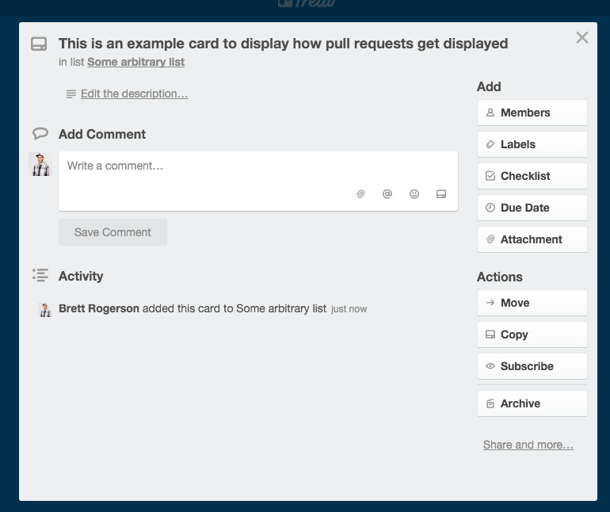
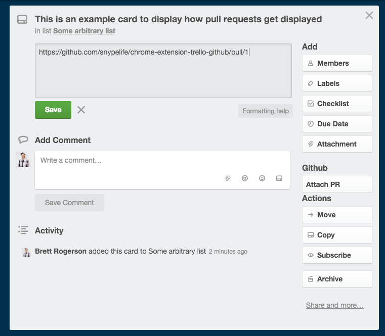
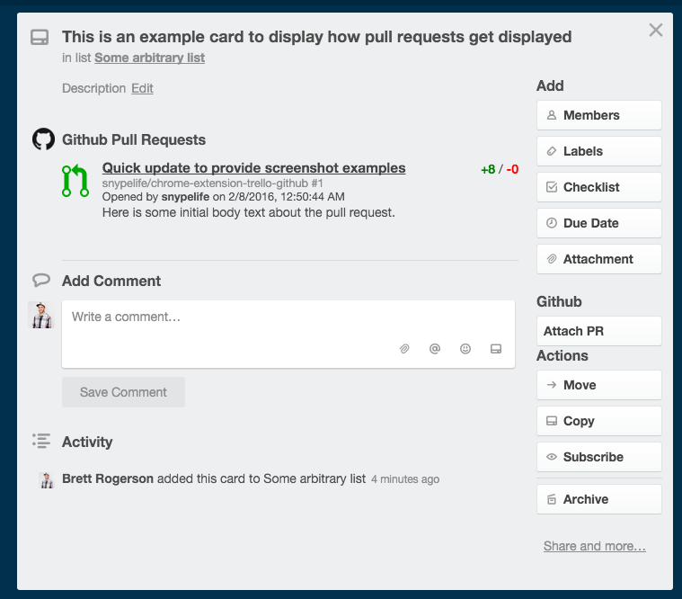
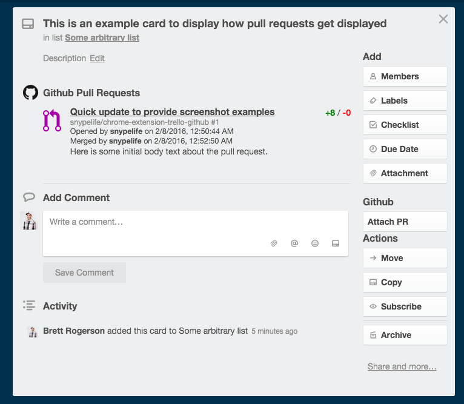

# chrome-extension-trello-github

##How to use the extension
### Pull requests
1. Simply copy a link to a pull request and paste it into the card description area. the extension will automatically swap the link for a ui element diplaying info about the pull request.

2. *Coming soon* A button in the right sidebar of an expanded card, that will allow you to search for a pull request and attach it to the card.

### Issues
Coming soon
